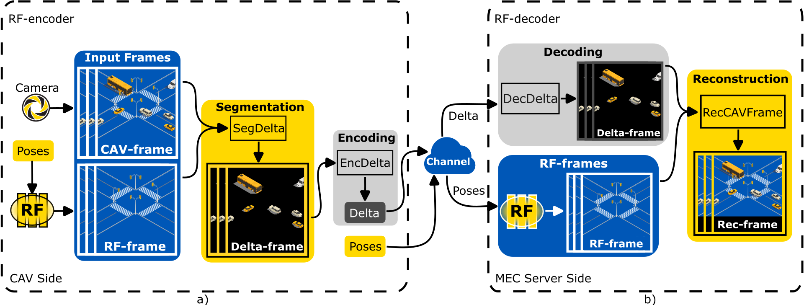

# Radiance Field Delta Video Compression in Edge-Enabled Vehicular Metaverse

[[PAPER]](https://arxiv.org/abs/2411.11857)

### Contribution
I. We present an RF-encoder and an RF-decoder architecture using distributed RFs as DTs for storing photorealistic 3D urban scenes in a compressed form.<br><br>
II.We propose delta segmentation (DS) algorithm for extraction of differences between CAV-frame and RF-frame pairs without being limited by a predefined set of
 classes using zero-shot generalization. We also guarantee
 the transmission of critical classes (e.g., pedestrians or
 vehicles) using semantic segmentation. <br><br>
III. We validate the data compression achieved by the
 RFDVC framework compared to H.264 and H.265
 codecs under different conditions as lighting changes,
 and rain. We also evaluate its performance under simulated packet loss to assess quality under challenging
 network conditions.

## Abstract
Connected and autonomous vehicles (CAVs) offload computationally intensive tasks to multi-access edge computing (MEC) servers via vehicle-to-infrastructure (V2I) communication, enabling applications within the vehicular metaverse, which transforms physical environment into the digital space enabling advanced analysis or predictive modeling. A core challenge is physical-to-virtual (P2V) synchronization through digital twins (DTs), reliant on MEC networks and ultra-reliable low-latency communication (URLLC). To address this, we introduce radiance field (RF) delta video compression (RFDVC), which uses RF-encoder and RF-decoder architecture using distributed RFs as DTs storing photorealistic 3D urban scenes in compressed form. This method extracts differences between CAV-frame capturing actual traffic and RF-frame capturing empty scene from the same camera pose in batches encoded and transmitted over the MEC network. Experiments show data savings up to 71% against H.264 codec and 44% against H.265 codec under different conditions as lighting changes, and rain. RFDVC also demonstrates resilience to transmission errors, achieving up to +0.29 structural similarity index measure (SSIM) improvement at block error rate (BLER) = 0.35 in non-rainy and +0.25 at BLER = 0.2 in rainy conditions, ensuring superior visual quality compared to standard video coding (VC) methods across various conditions.

## 1. Proposed RFDVC

Fig. 2. (a) The RF-encoder extracts pairs of input CAV-frames and RF-frames from the same camera poses to segment Delta-frames using the DS algorithm.
Delta-frames are then encoded via the codec (H.264 or H.265) and transmitted over the channel. (b) The RF-decoder subsequently decodes the delta and
combines Delta-frames with RF-frames to reconstruct Rec-frames.

## 2. Citation
If you use this code or ideas from the paper for your research, please cite our paper:
```
@misc{dopiriak2024rfdvc,
      title={Radiance Field Delta Video Compression in Edge-Enabled Vehicular Metaverse}, 
      author={Matúš Dopiriak and Eugen Šlapak and Juraj Gazda and Devendra S. Gurjar and Mohammad Abdullah Al Faruque and Marco Levorato},
      year={2024},
      eprint={2411.11857},
      archivePrefix={arXiv},
      primaryClass={eess.SP},
      url={https://arxiv.org/abs/2411.11857}, 
}
```